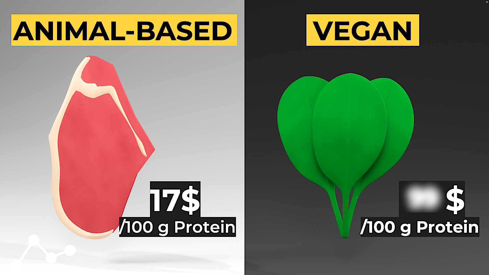

# Is vegan food cheap? I analyzed 11000 foods to find out

In this video for the YouTube channel Memeable Data, I analyzed the price and nutritional facts of 11000 products of a Dutch supermarket (Albert Heijn) and tried to determine if vegan food is cheaper than animal-based food.

The conclusions were:
* Vegan food generally has the cheapest sources of calories and protein
* However, for certain macronutrient requirements (e.g high protein or low carb percentage) the cheapest sources of protein are actually animal-based

In this repository you can find:
* Data with the nutritional facts of Albert Heijn's products
* Python script to scrape the data from the Albert Heijn website. Note that the script is no longer up to date
* Jupyter Notebook with data analysis

Link to YouTube video below:

https://youtu.be/mJs8L3oSmak

